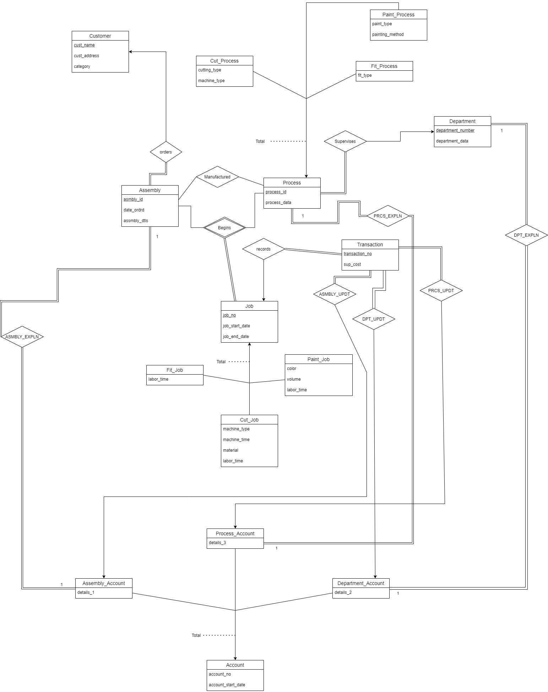

# JOB-SHOP-ACCOUNTING-SYSTEM

A job-shop accounting system is part of an organization that manufactures special-purpose assemblies for customers. 
A Relational Database Management system has been designed according to the accounting requirements given in the [Requirements](./Project_Requirements.pdf) File.

### Project Report
  * Project report can be found with detailed implementation steps and navigation [Project Report](./DB_REPORT.pdf)

####                                        E-R Diagram

 

Relational Database Schema 
 * i) Customer(cust_name, cust_address, category)
 * ii) Asmbly(asmbly_id, date_ordrd, asmbly_dtls, cust_name)
 * iii) Department(department_no, department_data)
 * iv) Process(process_id, process_data, department_no)
 * v) Fit_Process(process_id, fit_type)
 * vi) Cut_Process(process_id, cutting_type, machine_type)
 * vii) Paint_Process(process_id, paint_type, painting_method)
 * viii) Job(job_no, job_start_date, job_end_date, asmbly_id, process_id)
 * ix) Paint_Job(job_no, color, volume,labor_time)
 * x) Cut_Job(job_no, machine_type, machine_time, material, labor_time)
 * xi) Fit_Job(job_no, labor_time)
 * xii) Account(account_no, account_start_date)
 * xiii) Department_Account(account_no, details_2, department_no)
 * xiv) Asmbly_Account(account_no, details_1, asmbly_id)
 * xv) Process_Account(account_no, details_3, process_id)
 * xvi) Trnsctn(transaction_no, sup_cost, job_no, dep_acno, asmb_acno, prcs_acno)
 * xvii) Maufactured(asmbly_id, process_id)

