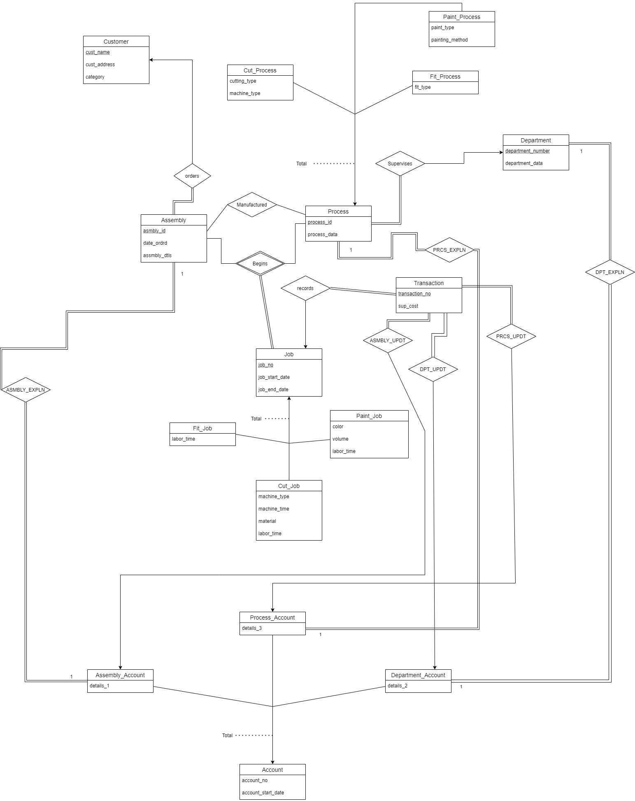

# JOB-SHOP-ACCOUNTING-SYSTEM

A job-shop accounting system is part of an organization that manufactures special-purpose assemblies for customers. 
A Relational Database Management system has been designed according to the accounting requirements given in the [Requirements](./Project_Requirements.pdf) File.

### Project Report
  * Project report can be found with detailed implementation steps and navigation [Project Report](./DB_REPORT.pdf)

####                                        E-R Diagram

