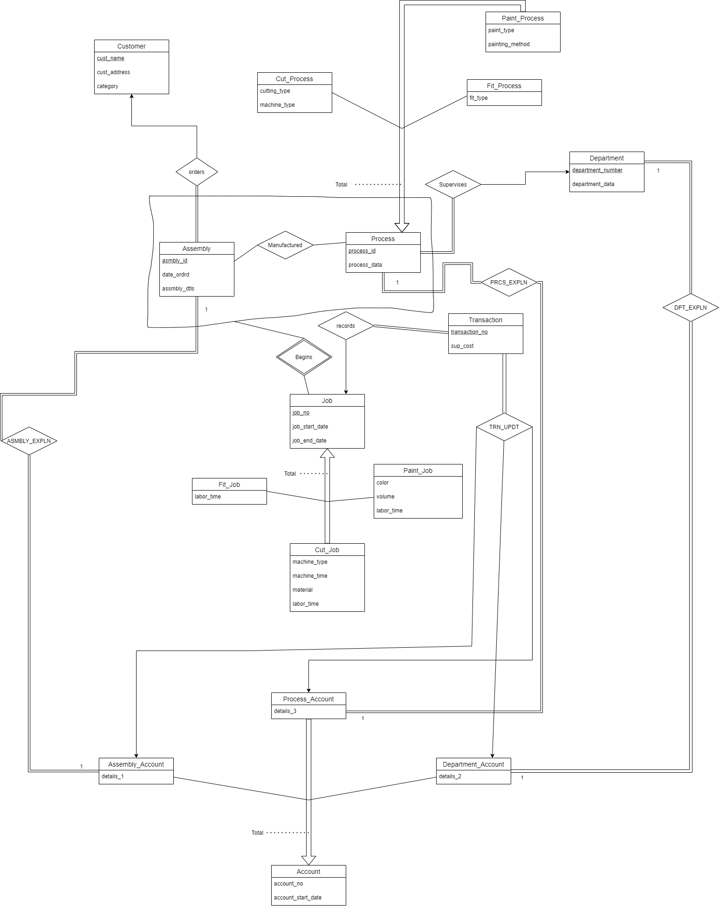

# JOB-SHOP-ACCOUNTING-SYSTEM

A job-shop accounting system is part of an organization that manufactures special-purpose assemblies for customers. 
A Relational Database Management system has been designed according to the accounting requirements given in the [Requirements](./Project_Requirements.pdf) File.

### Project Report
  * Project report can be found with detailed implementation steps and navigation [Project Report](./DB_REPORT.pdf)

####                                        E-R Diagram

 

#### Relational Database Schema 
 * Customer(cust_name, cust_address, category)
 * Asmbly(asmbly_id, date_ordrd, asmbly_dtls, cust_name)
 * Department(department_no, department_data)
 * Process(process_id, process_data, department_no)
 * Fit_Process(process_id, fit_type)
 * Cut_Process(process_id, cutting_type, machine_type)
 * Paint_Process(process_id, paint_type, painting_method)
 * Job(job_no, job_start_date, job_end_date, asmbly_id, process_id)
 * Paint_Job(job_no, color, volume,labor_time)
 * Cut_Job(job_no, machine_type, machine_time, material, labor_time)
 * Fit_Job(job_no, labor_time)
 * Account(account_no, account_start_date)
 * Department_Account(account_no, details_2, department_no)
 * Asmbly_Account(account_no, details_1, asmbly_id)
 * Process_Account(account_no, details_3, process_id)
 * Trnsctn(transaction_no, sup_cost, job_no, dep_acno, asmb_acno, prcs_acno)
 * Maufactured(asmbly_id, process_id)
 
TSQL Statements for creation of tables and indexes on tables can be found here [Create Tables](./Create-Tables.sql)

TSQL statements implementing Stored Procedures for the required online queries can be found here [Stored Procedures](./Stored_Procedures.sql)

A web database application is implemented using Azure SQL Database and JSP which provides the Web pages for query 1 and query 13. 
Code can be found here [Web Application](./Job_Shop_Accounting_System)
